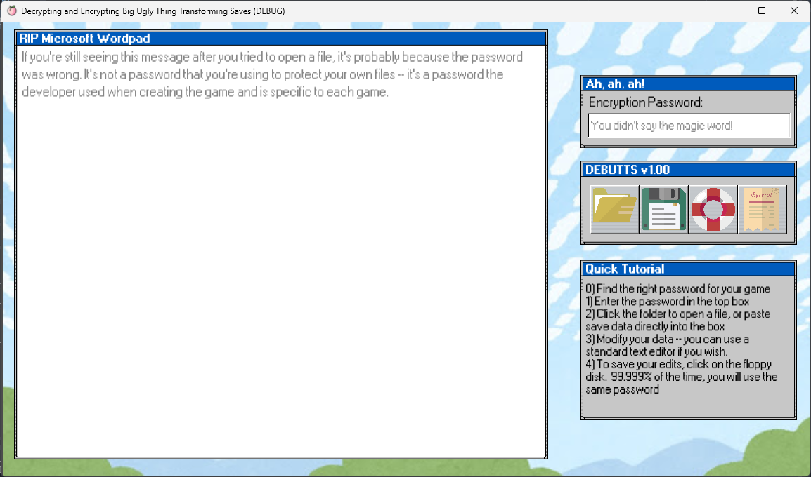

# Decrypting and Encrypting Big Ugly Thing Transforming Saves

## Welcome to DEBUTTS!

This app will decode save files from games made in the Godot save engine encrypted with its in-engine password-based function. It currently only works with games that save data in JSON format. You can then edit the save data inside the app, or in a separate text editor of your choice before encrypting the save file for use in your game.

You will need to find the password your game uses for encryption on your own; this may or may not entail reverse-engineering the game or extracting the package file, and may not may not be against the license your game is distributed under. Please do your own research regarding what is permissible in your jurisdiction!

## Installation

 1. Download from the releases page
 2. Extract the file in a place you can easily access it
	 ---Mac Users: I do not have $99/year to obtain an Apple programming license. The app will be considered "unnotarized" on Mac and you may need to extract it in a specific folder. [Follow the instructions from the official Godot tutorial to run the app](https://docs.godotengine.org/en/stable/tutorials/export/running_on_macos.html#doc-running-on-macos).
 3. Run DEBUTTS.exe (or .dmg or whatever your OS calls it)

## How to use
0. Find out the encryption password needed for your game. See the heading below for more information!
1. Enter the game's password in the top box
2. Click the folder icon to browser to your save file; its contents will be decrypted and displayed in the big window on the left.
3. Make changes as needed
	--You can also make your changes in a separate text editor then copy-paste the contents into the window.
4. Click the floppy disc icon and choose where to save your edited file
5. Open your game, load the file, and see what changes ye hath wrought!

## Got the password?

"[Walt sent me](https://youtu.be/97oBT_QrJ0M)." If it isn't that, you've got some sleuthin' to do! The password is almost certainly somewhere in the game data.   That game data may be encrypted, stored in a package file, stored in the game executable, or otherwise obfuscated. This means you may need to use tools available to [unpackage](https://github.com/DmitriySalnikov/GodotPCKExplorer) or [decompile](https://github.com/bruvzg/gdsdecomp) the game data in order to get the information you need. You might also have some luck using a hex editor and looking for features related to saving the game -- for Windows, I like [HxD](https://mh-nexus.de/en/hxd/).

Looking into any kind of questions related to obfuscating save data in Godot forums turns up, time and time again, that the engine makes it all-too-easy to un-obfuscate things. That doesn't mean it's OK, though! Do so at your own risk, legal or otherwise.

## Where's my save file?

Take a look at the ["User://" section in the Godot Engine tutorials](https://docs.godotengine.org/en/stable/tutorials/io/data_paths.html), but to keep it short, the best guess is:
| OS | Possible locations |
|---|---|
| Windows | %APPDATA%\\[custom_user_dir_name]   %APPDATA%\\Godot\\app_userdata\\[project_name]  %APPDATA%\\[project_name] |
| MacOS | ~/Library/Application Support/Godot/app_userdata/[project_name]  ~/Library/Application Support/[custom_user_dir_name]  ~/Library/Application Support/[project_name] |
| Linux | ~/.local/share/[project_name]  ~/.local/share/[custom_user_dir_name]  ~/.local/share/godot/app_userdata/[project_name] |

## Troubleshootin'

If you open a file and you don't see it's data in the main window, you probably have the wrong password. Right now, if the app fails to open a file, it does so silently without any feedback, but that's going to be your issue 99% of the time.

If you know you have the right password, or the file opens with the password but it gibberish, tweet @SushiKishi and let me know so I can look into it. It's probably an engine version issue; this app is built in Godot 4 so the encryption may have changed from older versions.

If you edit your save file and can no longer open it in your game, it could be one of any number of issues. I would start by trying to open your newly-updated save file in DEBUTTS with the same password and make sure the file contents are actually being saved.  If it is being saved, check that your JSON is valid in a JSON validator like [JSONlint](https://jsonlint.com/).

It may be that the save data isn't in JSON format at all, in which case the app can open it and spit out the text, but it won't be able to save.  If you run into this scenario, please let me know on Twitter! I can't actually look into how to save this type of data if I don't have some examples to work with!

If you save your file, but now it's empty when you open it in the app, well, this shouldn't happen but it might if you save without any password entered.

Please always back up your save files. ~~The app will attempt to do so for you and will save it in the app's data folder specific to your OS.~~ The developer is not responsible for any lost data.

## To-do:
1. Add in incremental save-file backups
2. Find some Godot games that use serial whatchamacallit to save the game so I can code support for that
3. Start a list of known save-file decryption passwords for games

## License:
The short version of the CC By 4.0 license is summarized by the deed available at the [Creative Commons website](https://creativecommons.org/licenses/by/4.0/deed.en), which states the following:
	
- You are free to:
	- Share — copy and redistribute the material in any medium or format for any purpose, even commercially.
	- Adapt — remix, transform, and build upon the material for any purpose, even commercially.
	-The licensor cannot revoke these freedoms as long as you follow the license terms.
- Under the following terms:
	- Attribution — You must give appropriate credit , provide a link to the license, and indicate if changes were made . You may do so in any reasonable manner, but not in any way that suggests the licensor endorses you or your use.
	- No additional restrictions — You may not apply legal terms or technological measures that legally restrict others from doing anything the license permits.

The complete and legally-binding version of the license is under LICENSE.md.

## Credits:
See the CREDITS.md file.
